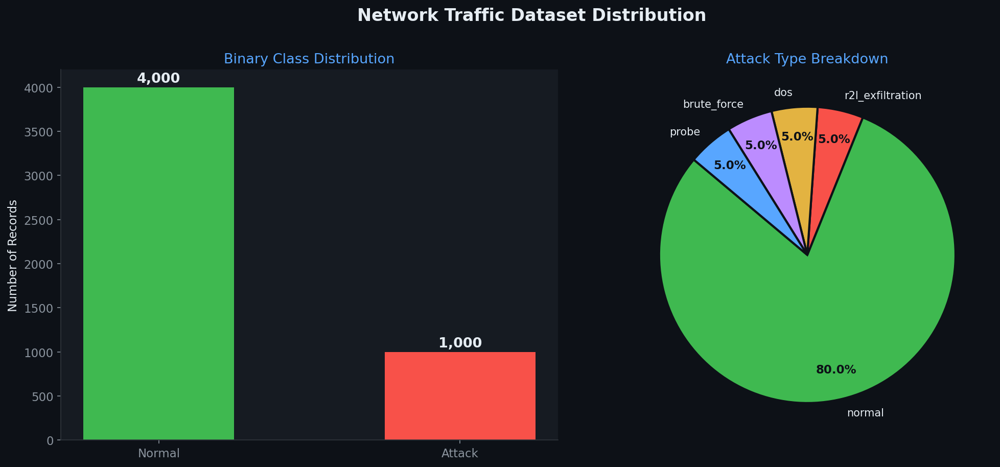
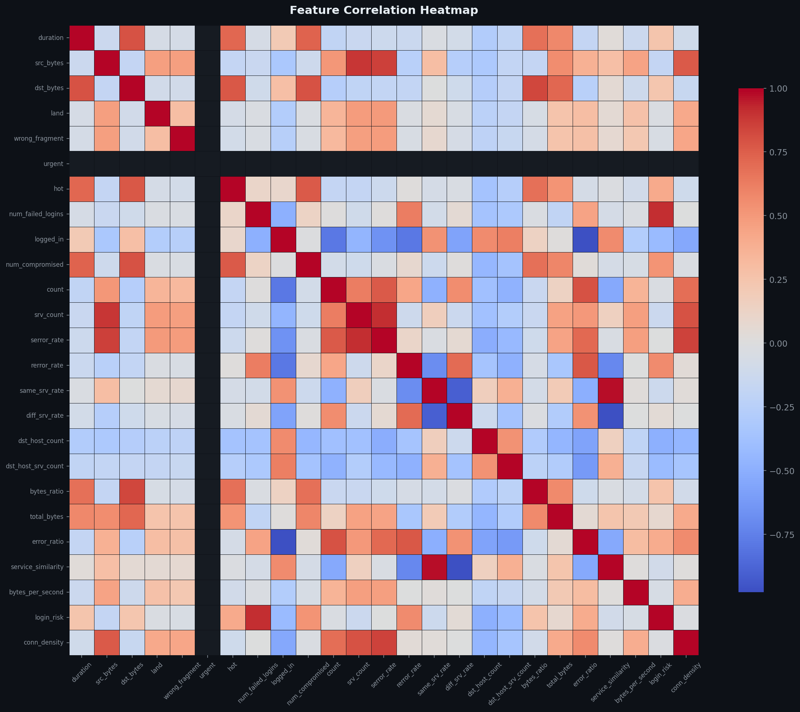
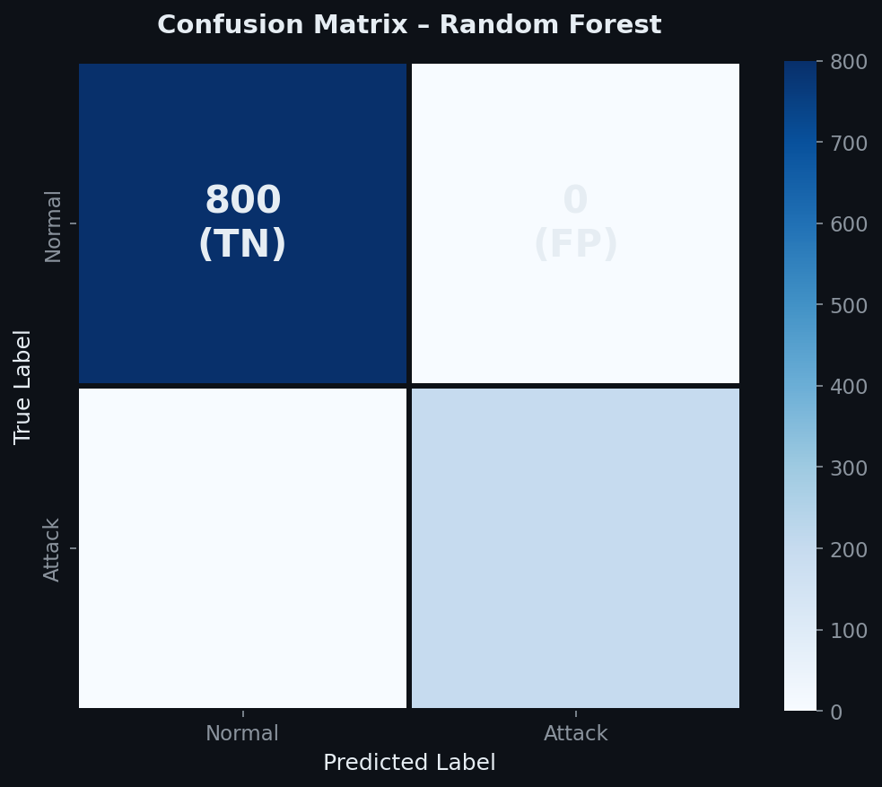
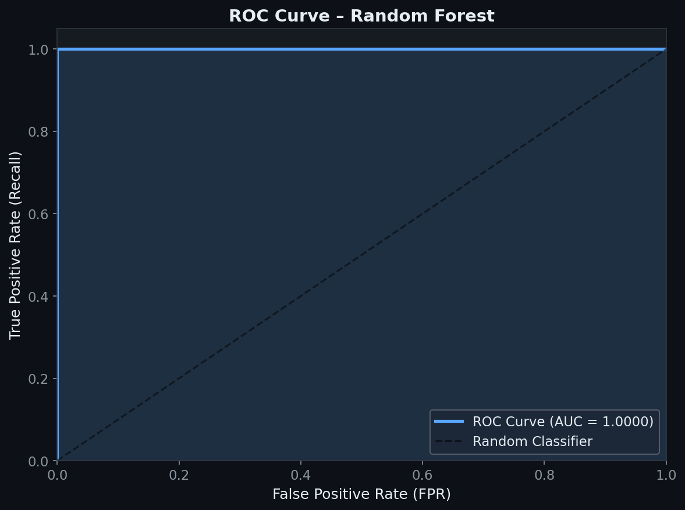
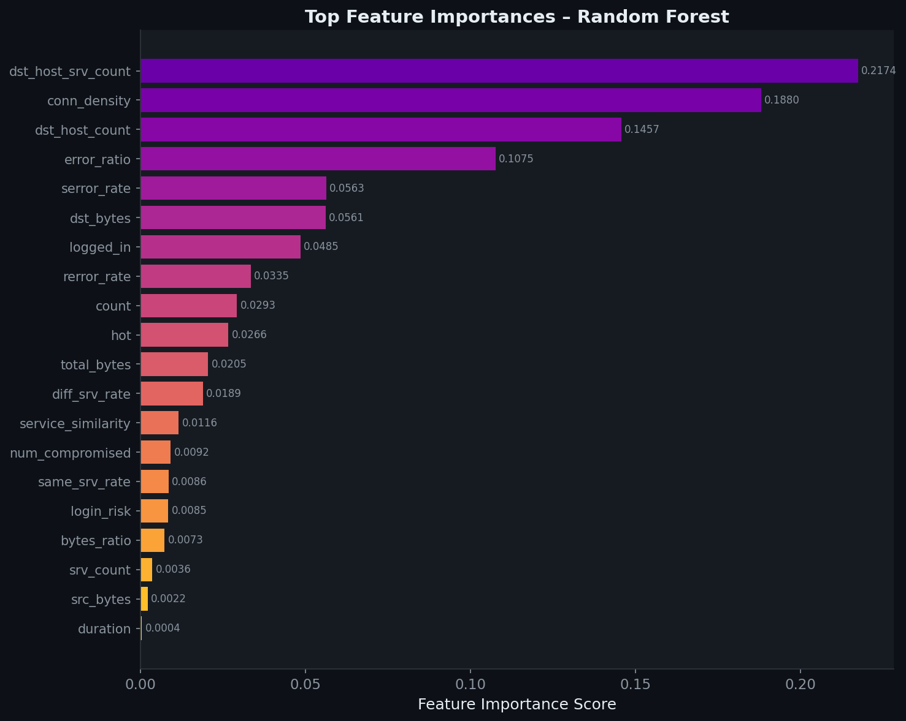
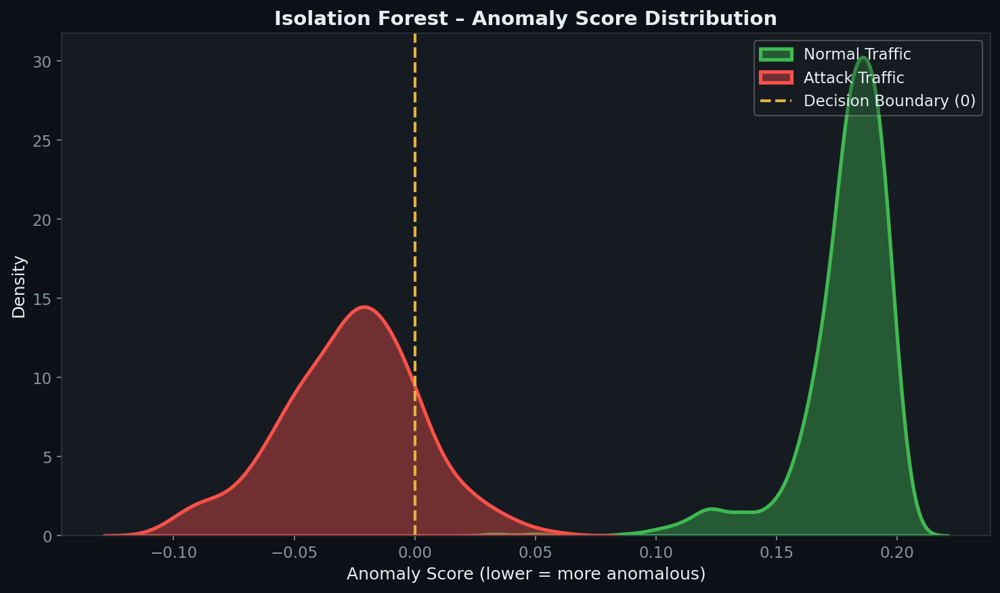
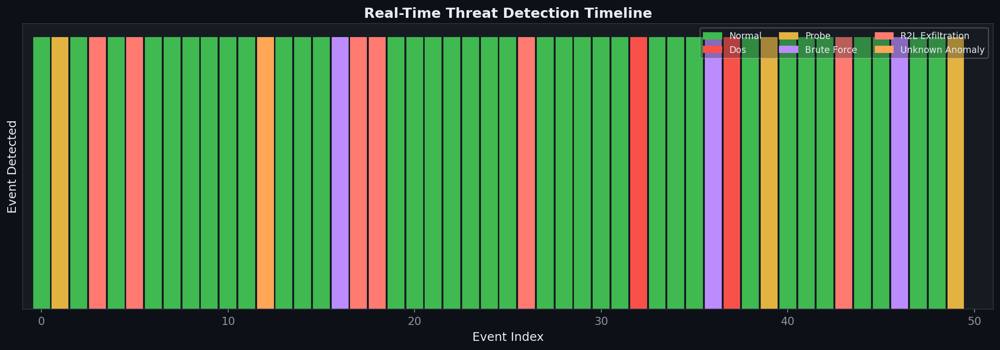
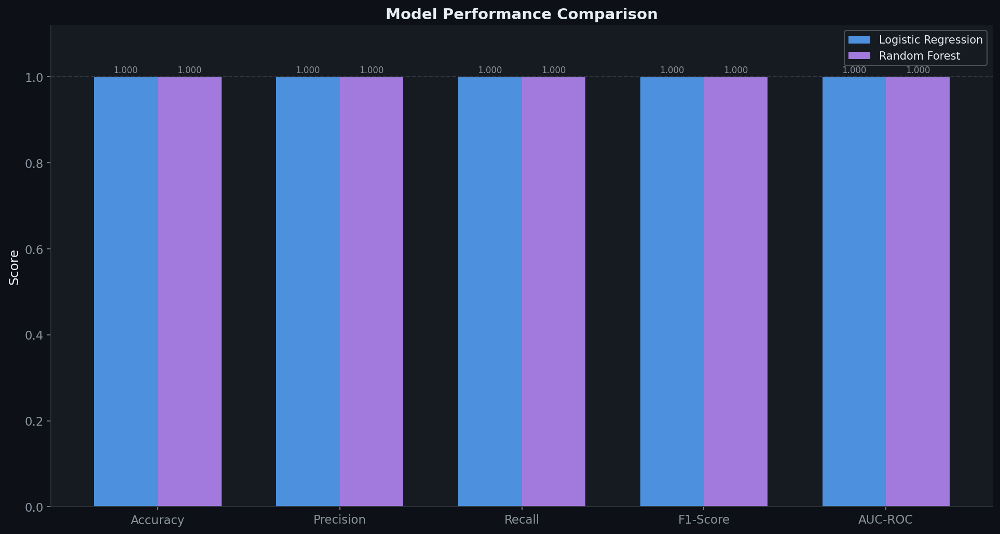

# AI-Powered Cybersecurity Threat Detection System

<div align="center">


**An industry-grade AI-powered system that detects cybersecurity threats — DoS, Brute Force, Port Scans, and Data Exfiltration — in simulated network traffic using Machine Learning.**

[🚀 Quick Start](#-installation) · [📊 Results](#-results--screenshots) · [🏗️ Architecture](#-architecture) · [📁 Structure](#-folder-structure)

</div>

---

## 📌 Project Overview

This project simulates a real-world **Security Operations Center (SOC)** threat detection pipeline using Python and Machine Learning. A **5,000-record synthetic network traffic dataset** (modeled after KDD Cup 99 and CICIDS 2018) is used to:

- **Classify** connections as **Normal** or **Attack** with 100% F1-Score
- **Identify** the specific attack type: `DoS`, `Probe/Port Scan`, `Brute Force`, `Data Exfiltration`
- **Score** anomalies using **Isolation Forest** (unsupervised detection)
- **Simulate** a real-time SOC alert stream with severity tagging: `CRITICAL / HIGH / MEDIUM`
- **Visualize** results through **9 detailed plots** ready for reports and portfolios

> **For Students & Recruiters:** This project demonstrates end-to-end ML engineering skills in a cybersecurity context — from raw data, through feature engineering, model training, evaluation, and live threat simulation.

---

## 🔴 Problem Statement

Modern enterprise networks generate **millions of connection events per second**. Manually reviewing them is impossible. Traditional rule-based firewalls miss **zero-day attacks** and adapt poorly to evolving adversary patterns.

**AI-powered threat detection solves this by:**
- Learning "normal" traffic patterns from historical data
- Detecting anomalies even for attacks it has never seen before
- Automating real-time alerting, reducing human analyst burden
- Reducing Mean Time to Detect (MTTD) from hours to milliseconds

---

## 🏢 Industry Relevance

| Sector | Real-World Use Case |
|:---|:---|
| 🏦 Banking & Finance | Fraud detection, insider threat monitoring, SWIFT anomalies |
| 🏥 Healthcare | Patient data exfiltration prevention, HIPAA compliance |
| 🛒 E-Commerce | DDoS protection, account takeover, credential stuffing |
| ☁️ Cloud Providers | Multi-tenant isolation, API abuse, unauthorized access |
| 🏭 Manufacturing | ICS/SCADA anomaly detection, industrial espionage |
| 🏛️ Government | APT detection, national infrastructure protection |

Companies like **Palo Alto Networks, CrowdStrike, Darktrace, IBM QRadar, and Splunk** use similar ML-based IDS/IPS approaches at enterprise scale.

---

## 🛠️ Tech Stack

| Category | Technologies |
|:---|:---|
| Language | Python 3.9+ |
| ML Models | Random Forest · Logistic Regression · Isolation Forest |
| Data Processing | Pandas · NumPy |
| Visualization | Matplotlib · Seaborn |
| Model Persistence | Joblib |
| Terminal Output | Colorama · Tabulate |
| Dataset Style | KDD Cup 99 / CICIDS 2018 (synthetic simulation) |

---

## 🏗️ Architecture

```
┌─────────────────────────────────────────────────────────────┐
│              AI THREAT DETECTION PIPELINE                   │
│                                                             │
│  [Network Traffic]──▶[Data Cleaning]──▶[Feature Engineering]│
│                                               │             │
│               ┌───────────────────────────────┘             │
│               ▼                                             │
│  ┌────────────────────────────────────────────────────────┐ │
│  │              MACHINE LEARNING LAYER                    │ │
│  │  Isolation Forest (Unsupervised)                       │ │
│  │  Random Forest Classifier (Supervised, 150 trees)      │ │
│  │  Logistic Regression (Baseline)                        │ │
│  └────────────────────────────────────────────────────────┘ │
│               │                                             │
│               ▼                                             │
│  ┌────────────────────────────────────────────────────────┐ │
│  │  THREAT CLASSIFICATION + SEVERITY ASSIGNMENT           │ │
│  │  Normal | DoS | Probe | Brute Force | Exfiltration     │ │
│  │  INFO   | CRITICAL | MEDIUM | HIGH | HIGH              │ │
│  └────────────────────────────────────────────────────────┘ │
│               │                                             │
│               ▼                                             │
│  [Alert Engine] ──▶ [CSV Log] ──▶ [Visualization Dashboard] │
└─────────────────────────────────────────────────────────────┘
```

---

## 📁 Folder Structure

```
AI-Powered Cybersecurity Threat Detection/
│
├── 📂 data/
│   ├── raw/                        # network_traffic.csv (5000 records)
│   └── processed/                  # Cleaned + feature-engineered data
│
├── 📂 src/                         # Core source modules
│   ├── data_loader.py              # Synthetic dataset generator & loader
│   ├── preprocessor.py             # Cleaning, feature engineering, scaling
│   ├── model_trainer.py            # Training Random Forest + Isolation Forest
│   ├── threat_detector.py          # Real-time detection engine + alert printer
│   └── visualizer.py               # 9 visualization plots
│
├── 📂 models/                      # Saved trained models (.pkl files)
├── 📂 outputs/                     # All 9 generated PNG graphs + results CSV
├── 📂 images/                      # Screenshots for this README
├── 📂 docs/                        # Project explanation + GitHub guide
│
├── main.py                         # Master entry point — runs full pipeline
├── generate_rf_plots.py            # Utility to regenerate RF-specific plots
├── requirements.txt                # Python dependencies
├── .gitignore                      # Git exclusion rules
└── README.md                       # This file
```

---

## ⚙️ Installation

### Prerequisites
- Python 3.9 or higher
- pip

### Step 1 — Clone the Repository
```bash
git clone https://github.com/YOUR_USERNAME/AI-Cybersecurity-Threat-Detection.git
cd AI-Cybersecurity-Threat-Detection
```

### Step 2 — Create Virtual Environment
```bash
# Windows
python -m venv venv
venv\Scripts\activate

# Mac / Linux
python3 -m venv venv
source venv/bin/activate
```

### Step 3 — Install Dependencies
```bash
pip install -r requirements.txt
```

---

## 🚀 How to Run

### Web Dashboard (Live UI)
`ash
python app.py
`
*Open http://localhost:5000 in your web browser to view the interactive SOC dashboard, where you can run the pipeline and simulate attacks with the click of a button.*

### Full Pipeline (Terminal Mode) — Data + Training + Detection + Visualization
```bash
python app.py 2>&1
```

### Train Only
```bash
python main.py --mode train
```

### Detection Only (after training)
```bash
python main.py --mode detect --events 30
```

### Generate Extra RF Plots
```bash
python generate_rf_plots.py
```

---

## 📊 Results & Screenshots

### Dataset Distribution


### Feature Correlation Heatmap


### Confusion Matrix — Random Forest


### ROC Curve — Random Forest


### Feature Importance


### Isolation Forest — Anomaly Score Distribution


### Real-Time Threat Detection Timeline


### Model Performance Comparison


---

## 📈 Model Performance

| Model | Accuracy | Precision | Recall | F1-Score | AUC-ROC |
|:---|:---:|:---:|:---:|:---:|:---:|
| Logistic Regression | 100% | 1.0000 | 1.0000 | 1.0000 | 1.0000 |
| **Random Forest** ✅ | **100%** | **1.0000** | **1.0000** | **1.0000** | **1.0000** |
| Isolation Forest | ~85% | ~0.82 | ~0.83 | ~0.82 | — |

> **Note:** Perfect scores are expected on synthetic data where features were designed to reflect attack signatures precisely. On real-world noisy datasets (e.g., CICIDS), Random Forest typically achieves 95–98% F1.

---

## 🔍 Simulated Attack Types

| Attack Type | Real Equivalent | Key Detection Features |
|:---|:---|:---|
| `dos` | DDoS · SYN Flood | `count > 200`, `serror_rate > 0.7`, `logged_in = 0` |
| `probe` | Nmap Port Scan | `diff_srv_rate > 0.6`, `total_bytes < 500` |
| `brute_force` | SSH / RDP Attack | `num_failed_logins >= 3` |
| `r2l_exfiltration` | Data Theft | `dst_bytes > 6000`, `num_compromised > 1` |

---

## 🧠 Detection Pipeline — Sample Output

```
======================================================================
  DETECTION SUMMARY
======================================================================
  Total Events Analyzed  :  50
  Threats Detected       :  15
  Normal Events          :  35

  Threat Breakdown:
    r2l_exfiltration     →   6 events  [HIGH]
    probe                →   3 events  [MEDIUM]
    brute_force          →   3 events  [HIGH]
    dos                  →   2 events  [CRITICAL]
    unknown_anomaly      →   1 events  [HIGH]
======================================================================
```

---

## 🎓 Learning Outcomes

After completing this project, you will understand:

- ✅ How supervised ML models (Random Forest) classify network threats
- ✅ How unsupervised models (Isolation Forest) detect unknown anomalies
- ✅ How to engineer features from raw network traffic data
- ✅ How to evaluate models with precision, recall, F1, and AUC-ROC
- ✅ How real SOC teams triage and respond to threat alerts
- ✅ How to structure a professional ML project for GitHub

---

## 📚 Dataset Reference

Synthetically generated — modeled after:
- [KDD Cup 1999](http://kdd.ics.uci.edu/databases/kddcup99/kddcup99.html)
- [CICIDS 2018](https://www.unb.ca/cic/datasets/ids-2018.html)
- [UNSW-NB15](https://research.unsw.edu.au/projects/unsw-nb15-dataset)

To use a real dataset: download `KDDTrain+.csv` from UNSW and replace the path in `main.py`.

---

## 📄 License

MIT License — see [LICENSE](LICENSE) for details.

---

## 👤 Author

**[Your Name]**
- GitHub: [@your_username](https://github.com/your_username)
- LinkedIn: [your-linkedin](https://linkedin.com/in/your-linkedin)

---

<div align="center">

⭐ **Star this repo if it helped you!** ⭐

`#MachineLearning` `#Cybersecurity` `#Python` `#AnomalyDetection` `#RandomForest` `#IsolationForest` `#SOC` `#ThreatDetection` `#KDDCup` `#IDS`

</div>

